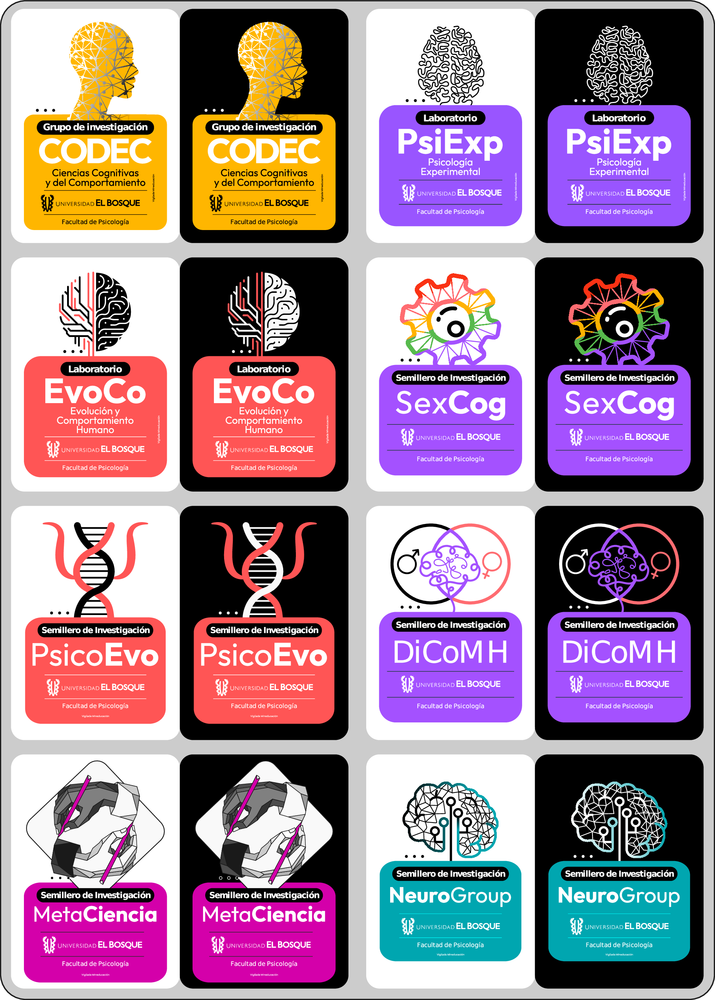

## Logos — [*CODEC: Ciencias Cognitivas y del Comportamiento*](https://investigaciones.unbosque.edu.co/codec)

Este repositorio contiene los logos oficiales del grupo de investigación [**CODEC**](https://investigaciones.unbosque.edu.co/codec) y de sus laboratorios y semilleros, pertenecientes a la Facultad de Psicología de la Universidad El Bosque (Bogotá, Colombia).

---

### Entidades incluidas

| Carpeta | Entidad |
|---|---|
| `CODEC/` | Grupo CODEC: Ciencias Cognitivas y del Comportamiento |
| `DiCoMH/` | Semillero DiCoMH: Diferencias Cognitivas entre Mujeres y Hombres |
| `EvoCo/` | EvoCo: Laboratorio de Evolución y Comportamiento Humano |
| `LabPsiExp/` | LabPsiExp: Laboratorio de Psicología Experimental |
| `MetaCiencia/` | Semillero MetaCiencia: Ciencia, Reproducibilidad y Transparencia |
| `NeuroGroup/` | Semillero NeuroGroup |
| `PsicoEvo/` | Semillero PsicoEvo: Psicología Evolutiva |
| `SexCog/` | Semillero SexCog: Sexualidad y Afectividad Humana |

---

### Vista previa



---

### Estructura y convención de nombres

Cada carpeta contiene cuatro archivos:

```
NombreLogo_sobre_oscuro.svg  ← para usar sobre fondos oscuros, vector
NombreLogo_sobre_oscuro.png  ← para usar sobre fondos oscuros, raster
NombreLogo_sobre_claro.svg   ← para usar sobre fondos claros, vector
NombreLogo_sobre_claro.png   ← para usar sobre fondos claros, raster
```

- **`_sobre_claro`** — versión adaptada para usar sobre fondos claros.
- **`_sobre_oscuro`** — versión adaptada para usar sobre fondos oscuros.
- **SVG** — formato vectorial.
- **PNG** — imagen con fondo transparente.

---

<sup>Logos diseñados y creados por [Juan David Leongómez](https://github.com/JDLeongomez)</sup>
